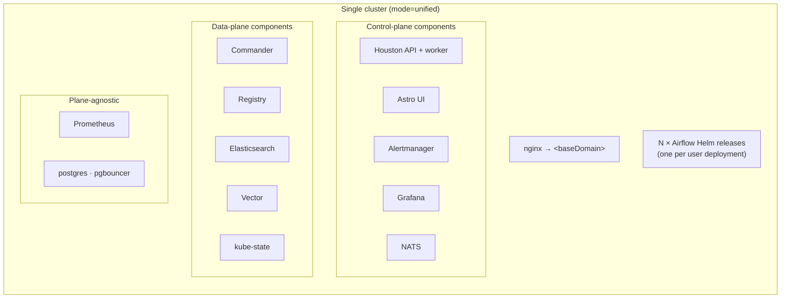
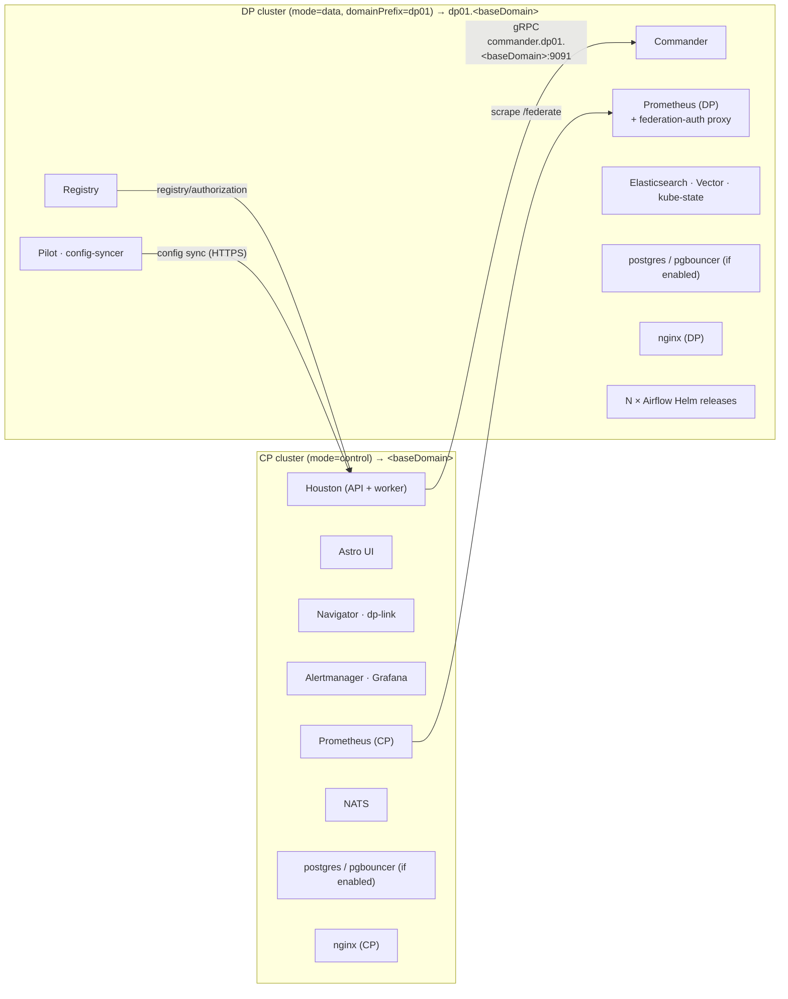
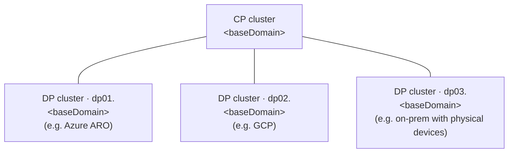

# APC Architecture

This document describes the architecture of the Astro Private Cloud (APC) platform across its installation modes. It is reference material for engineers working on the chart, operators deploying it, and AI agents acting on the codebase.

## Overview

APC is delivered as a single umbrella Helm chart in this repository. One Helm release installs the **platform** — the control surface (Houston, Astro UI, Commander), the image registry, the logging stack (Elasticsearch + Vector), the metrics stack (Prometheus, Alertmanager, Grafana), and the supporting infrastructure (NATS, ingress) — into a Kubernetes cluster. Once installed, the platform itself provisions user **Airflow deployments** on demand: each deployment is a separate Helm release (using `astronomer/airflow-chart`) that the platform's Commander service creates and manages in its own namespace.

The single chart can be installed in three modes, controlled by `global.plane.mode` in `values.yaml`:

| Mode                | What it installs                                                         | When to use                                                                 |
| ------------------- | ------------------------------------------------------------------------ | --------------------------------------------------------------------------- |
| `unified` (default) | Control Plane and Data Plane components co-located in one cluster        | Local development, single-cluster deployments, the v0.x compatibility shape |
| `control`           | Control Plane only                                                       | Multi-cluster deployments where one CP manages one or more remote DPs       |
| `data`              | Data Plane only, identified by `global.plane.domainPrefix` (e.g. `dp01`) | Each DP cluster attached to a remote CP                                     |

### Why the modes exist

The CP/DP split is an infrastructure separation of concerns. It lets operators scale the Data Plane horizontally without touching the Control Plane, and lets a single CP manage Data Planes that live in heterogeneous environments — for example one DP in Azure ARO, another in GCP, and another on-prem alongside physical devices. Unified mode is used primarily as a migration path from older versions that did not have a CP/DP split, and is not recommended for new installations.

## Component inventory

The table below lists components installed by this chart and the modes in which each one renders. "Gate" names the values that control the component beyond mode. Components grouped together are governed by a single tag in `Chart.yaml` (e.g. `monitoring`, `logging`, `platform`); disabling the tag disables the group.

### Control-plane components

These render when `global.plane.mode` is `control` or `unified`.

| Component          | Role                                                                              | Gate                                                      |
| ------------------ | --------------------------------------------------------------------------------- | --------------------------------------------------------- |
| Houston API        | GraphQL/REST API; source of truth for users, workspaces, and deployments          | `global.astronomer.enabled`                               |
| Houston worker     | Async job processor; invokes Commander to create/update Airflow deployments       | `global.astronomer.enabled`                               |
| Astro UI           | Web UI for the platform                                                           | `global.astronomer.enabled`                               |
| Navigator          | Multi-DP coordinator (used for DP failover)                                       | `navigator.enabled` or `global.dataPlaneFailover.enabled` |
| dp-link            | CP-side endpoint for DP-link traffic (DP failover path)                           | `dpLink.enabled` or `global.dataPlaneFailover.enabled`    |
| nginx (CP variant) | Ingress for CP hostnames at `<baseDomain>`                                        | `global.nginx.enabled`                                    |
| Alertmanager       | Alert routing for platform Prometheus                                             | `global.alertmanager.enabled`                             |
| Grafana            | Dashboards backed by CP Prometheus                                                | `global.grafana.enabled`                                  |
| NATS               | Message bus for Houston / Navigator / dp-link; multi-node cluster with JetStream  | `global.nats.enabled`                                     |

### Data-plane components

These render when `global.plane.mode` is `data` or `unified`.

| Component                   | Role                                                                      | Gate                                                  |
| --------------------------- | ------------------------------------------------------------------------- | ----------------------------------------------------- |
| Commander                   | gRPC service that runs `helm install/upgrade` per user Airflow deployment | `global.astronomer.enabled`                           |
| Registry                    | Docker registry for user-built Airflow images                             | `global.astronomer.enabled`                           |
| Pilot                       | DP-side health/failover agent                                             | `pilot.enabled` or `global.dataPlaneFailover.enabled` |
| config-syncer               | CronJob that pulls Houston configuration into the local cluster           | `configSyncer.enabled`                                |
| nginx (DP variant)          | Ingress for DP hostnames at `<domainPrefix>.<baseDomain>`                 | `global.nginx.enabled`                                |
| Prometheus federation proxy | Auth-protected `/federate` endpoint that CP Prometheus scrapes            | rendered only when `mode=data`                        |
| external-es-proxy           | Forwards logs to an external Elasticsearch                                | `global.customLogging.enabled`                        |
| Elasticsearch               | Log storage (master / data / client tiers all gated to DP)                | `global.elasticsearch.enabled`                        |
| Vector                      | Daemonset log collector                                                   | `global.daemonsetLogging.enabled`                     |
| kube-state                  | Kubernetes object metrics                                                 | `global.kubeState.enabled`                            |

### Plane-agnostic infrastructure

These render in every mode (subject to their own enable flag) and run independently in each cluster.

| Component                    | Role                                                              | Gate                                        |
| ---------------------------- | ----------------------------------------------------------------- | ------------------------------------------- |
| Prometheus                   | Metrics collection (per-plane instance)                           | `global.prometheus.enabled`                 |
| PostgreSQL                   | In-cluster database for dev/test (production should use external) | `global.postgresql.enabled`                 |
| PgBouncer                    | Connection pooling in front of Postgres                           | `global.pgbouncer.enabled`                  |
| prometheus-postgres-exporter | Database metrics                                                  | `global.prometheusPostgresExporter.enabled` |
| airflow-operator             | Optional CRD-based Airflow management                             | `global.airflowOperator.enabled`            |
| external-secrets (ESO)       | Secret synchronization                                            | `external-secrets.enabled`                  |

`Chart.yaml` is the canonical source for conditions and tags; `values.yaml` is the canonical source for `global.plane.*` defaults.

## How user Airflow deployments fit in

The platform installed by this chart is the _runtime_ that creates Airflow. Each user-facing Airflow deployment is a separate Helm release living alongside the platform release in the same DP cluster.

### Houston API and Houston worker

Houston is two cooperating deployments, both rendered only when `global.plane.mode` is `control` or `unified`:

- **Houston API** (`node dist/index.js`) — the synchronous GraphQL/REST endpoint that user-facing clients hit. It authenticates the request, validates it, writes the deployment row to Postgres, and hands the long-running work off to the queue.
- **Houston worker** (`yarn worker`) — a background process that subscribes to the queue, picks up jobs the API enqueued, and performs the slow operations (calling Commander, tracking helm-release status, retrying failures). The worker is also the gRPC client of Commander (its container env carries `GRPC_VERBOSITY` / `GRPC_TRACE`).

Both deployments run from the same Houston image and receive identical NATS configuration via the `houston_environment` helper:

```
NATS__SERVERS      = "<release>-nats-0.<release>-nats.<ns>.svc:4222", "<release>-nats-1...", "<release>-nats-2..."
NATS__CLUSTER_ID   = <release>-stan
```

The `-stan` suffix names a STAN cluster (NATS Streaming, the legacy persistent-messaging subsystem). The chart also enables NATS JetStream by default (`global.nats.jetStream.enabled: true`); when on, Houston's `production.yaml` gains a `nats:` block (with TLS material if `global.nats.jetStream.tls` is set, mounted at `/etc/houston/jetstream/tls`). Which subsystem actually carries the deployment-job queue is an application-level decision in the Houston codebase — the chart just stands up the infrastructure for both.

### End-to-end flow

1. A user mutates a deployment via the Astro UI, Houston API, or CLI.
2. **Houston API** validates the request, persists the deployment row to Postgres, and publishes a job on NATS.
3. **Houston worker** consumes the job from NATS and makes a gRPC call to Commander. In `unified` mode that's the in-cluster service (`<release>-commander:<ports.commanderGRPC>`); in split mode it crosses to the DP at `commander.<domainPrefix>.<baseDomain>:9091`. The chart sets `COMMANDER_WAIT_ENABLED=true` only in `unified` mode, so in split mode the worker assumes Commander is reachable externally rather than waiting on a local readiness signal.
4. **Commander** runs `helm install` / `helm upgrade` against the chart referenced by `astronomer.houston.config.deployments.helm.airflow` — the external `astronomer/airflow-chart` — into a dedicated namespace.
5. The new Airflow release runs alongside (but independently of) the APC platform release.

Two consequences worth noting:

- The API never blocks on Helm operations. A failed install does not fail the user-facing API call; the worker reconciles against state in Postgres and retries.
- A healthy DP cluster contains **one APC Helm release plus N Airflow Helm releases**, one per user deployment. The chart's RBAC (`charts/astronomer/templates/commander/commander-role.yaml`), network policies, and registry are sized to accommodate many sibling Airflow releases that this chart never templates directly.

## Cross-plane communication

In `control` + `data` deployments, the two planes are wired together through ingress on each side and a small set of shared secrets. All wires assume the CP is reachable at `<baseDomain>` and each DP at `<domainPrefix>.<baseDomain>`.

### CP → DP

| Wire                                                                 | Purpose                                        |
| -------------------------------------------------------------------- | ---------------------------------------------- |
| Houston worker → `commander.<domainPrefix>.<baseDomain>:9091` (gRPC) | Drives Airflow deployment lifecycle on the DP  |
| Houston/UI → Commander metadata HTTP ingress                         | Reads DP-side cluster and deployment state     |
| CP Prometheus → `prometheus.<domainPrefix>.<baseDomain>/federate`    | Aggregates DP metrics into platform dashboards |

### DP → CP

| Wire                                                                        | Purpose                                          |
| --------------------------------------------------------------------------- | ------------------------------------------------ |
| Kubelet/containerd in DP → `houston.<baseDomain>/v1/registry/authorization` | Authorizes image pulls from the DP registry      |
| config-syncer (DP) → Houston HTTPS                                          | Pulls platform configuration into the DP cluster |

### Shared trust and auth

- **Shared registry auth token.** `global.authHeaderSecretName` references the same Secret on both planes. It signs registry-authorization round-trips and authenticates Prometheus federation.
- **TLS certificate.** `global.tlsSecret` (default `astronomer-tls`) must cover both `<baseDomain>` (and its subdomains) and each `<domainPrefix>.<baseDomain>` it serves. The k3d setup script generates a cert with SANs for all of these.
- **Private CA trust.** `global.privateCaCerts` is a list of Secret names containing CA bundles; pods mount them at `/usr/local/share/ca-certificates/` and run `update-ca-certificates` on start (controlled via `UPDATE_CA_CERTS`). `global.privateCaCertsAddToHost` extends the trust to the node so kubelet/containerd can pull from registries signed by the same CA.
- **Cluster-local service auth.** `global.clusterLocalServiceAuth.token` is auto-generated and shared between intra-plane services (e.g. Pilot ↔ Commander) for gRPC authentication.

### NATS is not cross-plane

NATS runs only on the Control Plane (templates are gated to `control` and `unified`). It is the internal message bus for Houston, Navigator, and dp-link, and the Data Plane does not run or call it. The chart ships NATS as a multi-node cluster with JetStream enabled (`global.nats.replicas`, default 3); the `leafnode` and `gateway` knobs in `charts/nats/values.yaml` exist for advanced setups but are not used by the stock chart.

## Topology

### Unified mode



### Split mode (control + data)



### Multiple Data Planes

One CP can serve N Data Planes. Each DP installs the chart with a unique `global.plane.domainPrefix` (e.g. `dp01`, `dp02`, …) and a TLS cert that covers its prefix.



## Where to look next

- [`Chart.yaml`](../Chart.yaml) — canonical list of sub-charts with their `condition` and `tags`.
- [`values.yaml`](../values.yaml) — `global.plane.*`, `global.tlsSecret`, `global.authHeaderSecretName`, `global.privateCaCerts`, and the `*.enabled` flags referenced above.
- [`docs/cp-dp-k3d-setup-guide.md`](cp-dp-k3d-setup-guide.md) — working example of a split deployment on k3d, with the CoreDNS and TLS wiring spelled out.
- [`docs/local-development.md`](local-development.md) — quick-start for chart development and local clusters.
- `astronomer/airflow-chart` repo — the chart that Commander instantiates per user deployment.
