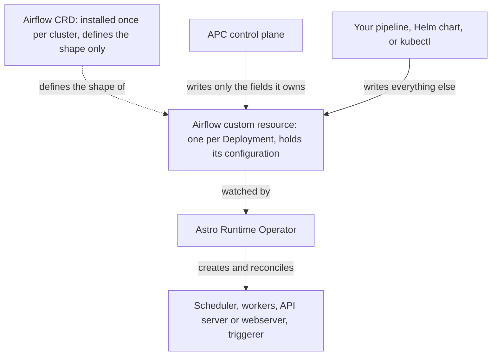
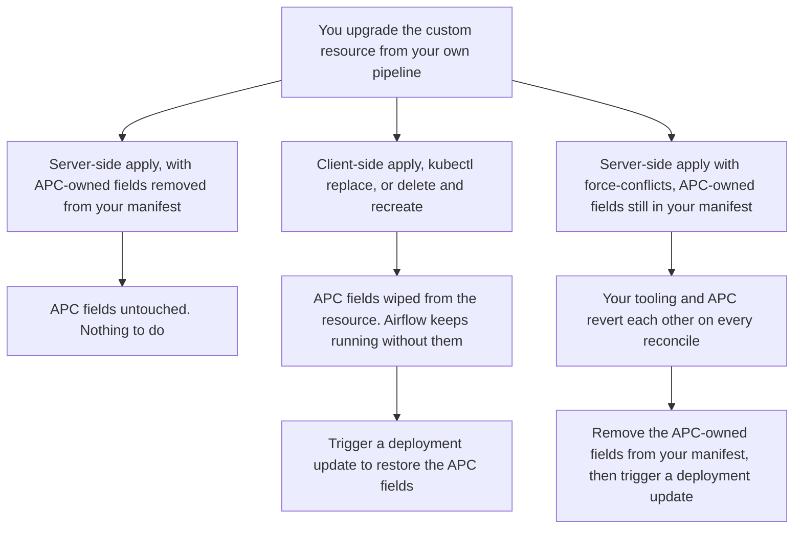

<!--
REVIEW NOTES: remove this block before publishing.

Draft target: docs repo, api/fern/docs/pages/apc-2.0/adopt-operator-deployments.mdx

Links to other APC pages are full published URLs under
https://www.astronomer.io/docs/astro-private-cloud/v-2-x/, so they resolve from this draft, from
Linear, and from the docs repo. Note that pages inside apc-2.0 normally link to each other with
bare slugs (for example `(register-data-plane)`), which is what Fern expects and what keeps links
working across version cuts. When this page lands in the docs repo, consider shortening the
in-product links to bare slugs; the absolute form still works either way.

Open items:
  1. "Run the Astro Runtime Operator" has no page in the docs repo. The Prerequisites section
     describes the requirement inline and links nothing. A dedicated operator page should exist
     before publication, then be linked from Prerequisites and from Overview.
  2. Cordon and uncordon are undocumented anywhere in apc-2.0. This page documents them for
     adopted deployments only. If cordon gets its own page, cut this page's section down to a link.
  3. Every behavior below was verified against houston-api, apc-ui, and astro-cli. Two behaviors
     described under "Known limitations" are real today and would ideally be fixed rather than
     documented: web access after release, and platform upgrades restarting adopted deployments.
  4. "Keep your own pipeline and APC from fighting" documents workarounds for two product gaps.
     There is no first-class resync or repair action, so the guidance is a no-op upsert. And the
     create-once Secrets are not self-healing, so a pruned Secret needs support to reissue. If
     either gap is closed, rewrite that section: the resync becomes a real action, and the
     Secret warning can be softened to a note.
  5. "Worker queues and autoscaling" and "Data plane failover" came from Ian Buss's questions in
     #eng-astronomer-software. Both were verified: `workers` is deliberately absent from the
     adopted spec allowlist (so APC never writes worker sizing or KEDA), and neither failover
     resolver has any adopted/operator-mode awareness. Note that a Slack answer in that thread
     said worker count and resources are APC-controlled for adopted deployments; that is not
     what the code does, and this page documents the verified behavior instead.
  6. Ian's stated preference is to BLOCK failover initiation for adopted deployments in code
     rather than document it, acknowledged as too late for 2.1. If that block ships, replace the
     "nothing stops you" warning with the real error behavior.
-->

If you already run Airflow with the Astro Runtime Operator, you can bring those deployments under Astro Private Cloud (APC) management by **adopting** them. Your Airflow keeps running. Nothing is recreated, and the operator continues to reconcile the underlying resources. After adoption, you manage the deployment from the APC control plane like any other: deploy code, change environment variables, resize components, and view metrics and logs.

Adoption is the second stage of a two-stage path onto the platform:

- **Stage 1**: you run Airflow with the Astro Runtime Operator on your own Kubernetes cluster. Each Airflow deployment is defined by one Airflow custom resource, and the operator turns that resource into the running Kubernetes workloads.
- **Stage 2**: you register that cluster as an APC data plane and adopt its Airflow deployments. APC takes ownership of a defined set of settings, and the operator continues to own the rest.

How the pieces fit together, since the terms are easy to mix up:

- The operator's **Custom Resource Definition (CRD)** is installed once on the cluster. It only defines the shape of an Airflow resource; it doesn't hold any deployment's configuration.
- Each of your Airflow deployments is one **Airflow custom resource**, created against that definition. It holds that deployment's configuration.
- The **operator** watches those custom resources and builds the real Kubernetes objects from them: schedulers, workers, services, and the rest.

Adoption doesn't rearrange any of that. APC writes directly to an individual custom resource, and the operator reconciles the change exactly as it would if you had edited the resource yourself. Nothing is written to the CRD, and APC never replaces the operator.



Both writers act on the same custom resource, so which fields each one owns is the thing to understand before you adopt: see [What adoption changes](#what-adoption-changes). If you stop touching the resource yourself after adoption, the second arrow simply goes away; if you keep managing it, read [Keep your own pipeline and APC from fighting](#keep-your-own-pipeline-and-apc-from-fighting).

When you adopt a deployment, APC applies the configuration it owns to that deployment's Airflow custom resource, so expect the deployment's pods to restart once shortly after you adopt. Read [What adoption changes](#what-adoption-changes) before you begin so you know what APC takes over.

## What adoption changes

When APC adopts an Airflow deployment, it takes ownership of a specific set of fields and leaves everything else to you and the operator. In this release, nothing outside the "APC takes over" column is modified, either at adoption or on any later update.

Ownership is split rather than transferred wholesale because your custom resource can express things APC has no equivalent for: more than one worker queue, KEDA autoscaling, per-component pod templates, sidecars. APC claims only the fields it needs in order to manage the deployment, which is what image it runs, which executor, the web component it puts authentication in front of, and the labels its monitoring and log shipping key on. If it claimed the rest, every update would have to overwrite your configuration with APC's narrower model. Leaving those fields alone is what makes adoption non-destructive. The trade-off is that they stay managed where they are today, through the operator, rather than through APC.

This is where the line falls today, not a permanent boundary. APC does not yet cover everything the Astro Runtime Operator can express, and the set of settings it manages is expected to widen in future releases. Check this page against the version of APC you are running rather than assuming the split is fixed.

| APC takes over | Stays yours |
| --- | --- |
| Airflow image and Astro Runtime version. APC owns these fields from adoption, but seeds them from your existing custom resource, so the deployment keeps running the image it already had until you deploy new code. | Sizing and replica counts for every component except the webserver or API server, including the scheduler, workers, triggerer, and DAG processor |
| Executor selection (see the warning under [Worker queues and autoscaling](#worker-queues-and-autoscaling)) | Your `airflow.cfg` and any config you set through it |
| The webserver (Airflow 2) or API server (Airflow 3) component **in full**, including its ingress, authentication, resources, and replicas | Pod template overrides on every other component, including custom volumes, sidecars, tolerations, and node selectors. APC adds its own labels to those pod templates for attribution and log routing, but changes nothing else in them |
| Environment variables you set through APC | Environment variables referencing your own Secrets or ConfigMaps |
| Metrics exporter labels and the network policy rules needed to scrape them | Your metadata database, its connection Secrets, and its credentials |
| Nothing in the worker section | Every worker queue and its KEDA autoscaling, including queues beyond the first |
| Task logging destination and image pull Secret (**only if you opt in**) | Task logging and image registry configuration if you do not opt in |

<Warning>
**APC takes over Airflow web access.** APC applies its own authentication and ingress to the webserver or API server component on every adopted deployment. If your Airflow currently authenticates users through LDAP, a `REMOTE_USER` proxy, or a custom `webserver_config.py`, that configuration is replaced with APC sign-in the first time APC applies its configuration.

This is why [importing the deployment's users](#step-4-import-the-deployments-users) is a required step and not an optional one. Users who exist only in your Airflow's own user table cannot sign in after adoption until you import them into APC.
</Warning>

Two more things before you start:

- **Component resources are brought into your platform's supported range.** If a component in your custom resource requests less than your platform's minimum or more than its maximum, APC adjusts it to the nearest supported value at adoption. See [Configure component size limits](https://www.astronomer.io/docs/astro-private-cloud/v-2-x/configure-component-size-limits).
- **Adoption is not a migration of history.** Existing task logs stay wherever they are today. If you switch task logging to APC, only logs written after the switch are readable from the Airflow UI; older ones remain in your own store but the Airflow UI no longer resolves them.

<Warning>
**Don't adopt a deployment whose image is pinned by digest.** If your custom resource references its image by digest (`myrepo/airflow@sha256:...`) rather than by tag, adoption rewrites it to a tag reference built from the deployment's Astro Runtime version (`myrepo/airflow:<runtime-version>`). The digest pin is lost, and if that tag doesn't exist in your repository the deployment stops being able to pull its image.

This happens on the first apply, before you deploy anything. Re-tag the image and update the custom resource to reference it by tag before adopting, or hold off on adopting that deployment. Astronomer is addressing this.
</Warning>

## Prerequisites

- Airflow deployments running under the Astro Runtime Operator.
- The operator's cluster registered as an APC data plane. See [Install a data plane cluster](https://www.astronomer.io/docs/astro-private-cloud/v-2-x/install-data-plane) and [Register a data plane cluster](https://www.astronomer.io/docs/astro-private-cloud/v-2-x/register-data-plane).
- Operator support and adoption enabled on your platform. See [Enable adoption on your platform](#enable-adoption-on-your-platform).
- Permission to adopt. Two permissions are involved: `workspace.deployments.adopt` to adopt a deployment into a workspace, and `system.deployments.adopt` to browse adoption candidates, which is separate because listing candidates scans a whole cluster. Among the built-in roles, **Workspace Admin** carries the first and **System Admin** the second. **Cluster Admin does not carry either**, because it governs cluster configuration rather than deployments. If your platform uses custom roles, both permissions can be granted to one. See [Manage permissions](https://www.astronomer.io/docs/astro-private-cloud/v-2-x/manage-permissions) and the [role and permission reference](https://www.astronomer.io/docs/astro-private-cloud/v-2-x/role-permission-reference).
- No existing APC deployment using the custom resource's name, or the namespace it runs in. Adoption is rejected if either is already taken.
- The custom resource references its image **by tag, not by digest**. See the warning under [What adoption changes](#what-adoption-changes).
- To use the Astro CLI instead of the UI, APC **2.1.0 or later** and a matching Astro CLI. See [Install the Astro CLI](https://www.astronomer.io/docs/astro/cli/install-cli).

<Note>
Running the Astro Runtime Operator itself is outside the scope of this page. Adoption requires only that the operator is running and that its Airflow custom resources are healthy on a cluster you have registered as a data plane.
</Note>

## Enable adoption on your platform

Adoption is off until operator support is turned on in your platform's Helm values. This is done by whoever installs or upgrades APC, so if someone else runs your platform, send them this section. If your platform already runs operator-based deployments, adoption is likely on already; check with [Confirm it's enabled](#confirm-its-enabled).

Two values control it:

| Value | Default | What it does |
| --- | --- | --- |
| `global.airflowOperator.enabled` | `false` | Turns on operator-based Airflow deployments. Required for adoption. |
| `global.airflowOperator.adoption.enabled` | `true` | Allows APC to adopt deployments that already exist on the cluster. |

<Note>
`global.airflowOperator.adoption.enabled` is already `true`, but it does nothing on its own. Adoption is enabled only when **both** values are `true`, so on a default install you enable adoption by setting `global.airflowOperator.enabled: true`. Leave the adoption value alone unless you specifically want operator support without adoption, in which case set it to `false`.
</Note>

Set these on **both planes**. Each plane uses them for something different, so enabling only one leaves adoption broken.

### Control plane values

The control plane needs the values so the APC API accepts operator mode and the adoption operations:

```yaml
global:
  airflowOperator:
    enabled: true
    adoption:
      enabled: true
```

### Data plane values

The data plane needs the values so APC is granted permission to read and manage the Airflow custom resources on the cluster, and so its monitoring stack scrapes operator-managed deployments.

Because your cluster **already runs the Astro Runtime Operator**, also switch off the bundled operator so APC doesn't install a second one alongside yours:

```yaml
global:
  airflowOperator:
    enabled: true
    adoption:
      enabled: true

airflow-operator:
  # Skip installing APC's own operator; this cluster already runs one.
  enabled: false
```

<Warning>
Set `airflow-operator.enabled: false` but keep `global.airflowOperator.enabled: true`. Setting the global value to `false` to avoid installing a second operator also switches off the permissions and the API operations adoption depends on, so adoption stops working entirely.
</Warning>

If you're running a unified install, where the control plane and data plane share one cluster and namespace, apply both sets of values together.

### Apply the values

Add the values to the platform configuration file you install with, then upgrade the release. See [Apply platform configuration](https://www.astronomer.io/docs/astro-private-cloud/v-2-x/apply-platform-config), and [Install the control plane](https://www.astronomer.io/docs/astro-private-cloud/v-2-x/install-control-plane), [Install a data plane cluster](https://www.astronomer.io/docs/astro-private-cloud/v-2-x/install-data-plane), or [Install a unified cluster](https://www.astronomer.io/docs/astro-private-cloud/v-2-x/install-unified) for the install and upgrade commands.

Enabling operator support does not change deployments that already exist. It adds the operator-mode and adoption capability for new work.

### Confirm it's enabled

Sign in to the control plane as a System Admin and look for **Admin** > **Adoption Candidates**. If the section is there, adoption is enabled. If it's missing, or an adopt call reports that operator adoption is disabled, one of the two values is still `false` on the control plane.

## Step 1: Decide how to handle logging, images, and metrics

Adoption asks you to make two choices, logging and images. Both are set when you adopt and are not intended to be changed afterwards, so decide before you start. Metrics need no decision: they are always on.

### Task logging

Choose whether APC becomes the destination for your task logs.

- **Route logs to APC.** APC configures Airflow to write task logs to APC's configured log store, and the Airflow UI reads them back from there. This **overrides your deployment's existing remote logging**. If your tasks currently log to Amazon S3, Google Cloud Storage, or your own Elasticsearch, they log to APC instead from then on. Logs written before the switch stay where they are, and the Airflow UI no longer resolves them.
- **Keep your own logging.** APC changes nothing about logging. Your tasks keep logging where they do prior to adoption, not in APC's configured log store.

See [Configure logging](https://www.astronomer.io/docs/astro-private-cloud/v-2-x/logs-configuration), [Export task logs](https://www.astronomer.io/docs/astro-private-cloud/v-2-x/export-task-logs), and [Send logs to S3](https://www.astronomer.io/docs/astro-private-cloud/v-2-x/logs-to-s3).

### Image registry

Two separate settings decide where your deployment's image comes from. Don't confuse them.

**Your platform's registry** is configured once, for every deployment on the platform, adopted or not. By default that's APC's built-in registry. To use your own instead, configure a custom image registry before you adopt: see [Use a custom image registry](https://www.astronomer.io/docs/astro-private-cloud/v-2-x/custom-image-registry) and [Registry backend](https://www.astronomer.io/docs/astro-private-cloud/v-2-x/registry-backend). APC synchronizes that registry's credential into every deployment namespace, including adopted ones.

**The adoption choice** is narrower. It decides whether APC manages *this deployment's* image reference and pull credential:

- **Use APC's registry** (`--use-apc-registry`). APC takes over the deployment's image and provisions the pull credential its pods need. You don't have to move the image yourself first: adoption leaves the deployment on the image it already runs, and the switch to your platform's registry happens on your first `astro deploy`, which moves the image and the pull credential together. Deploy code with `astro deploy` or a CI/CD pipeline as normal. See [Deploy code overview](https://www.astronomer.io/docs/astro-private-cloud/v-2-x/deploy-code-overview) and [CI/CD](https://www.astronomer.io/docs/astro-private-cloud/v-2-x/ci-cd).
- **Keep your own** (the default). APC leaves the deployment's image and pull Secret exactly as they are and never manages them. Use this when something outside APC builds and pushes the image.

#### Deploying code when you keep your own image

You can still ship new code through APC. Build and push the image to your own registry, then point the deployment at it:

```bash
astro deploy --remote --image-name=<your-registry>/<repository>:<tag> --runtime-version=<runtime-version> <deployment-id>
```

APC updates the deployment to run that image without touching your registry or your pull credential. `--runtime-version` is required with `--remote`. Your platform administrator must have set `deployments.enableUpdateDeploymentImageEndpoint: true`, which the [custom image registry](https://www.astronomer.io/docs/astro-private-cloud/v-2-x/custom-image-registry) setup already covers.

<Warning>
**Don't run plain `astro deploy` on a deployment that kept its own image.** Without `--remote`, `astro deploy` builds your project and pushes it to APC's built-in registry, then repoints the deployment at it. Because you opted out, APC never provisioned a credential for that registry, so the deployment's pods fail to pull the new image and stop starting. The command reports success, and the previous working image reference is gone.

Use `--remote --image-name` as shown above, or adopt with `--use-apc-registry` if you want APC to own the deployment's image.
</Warning>

<Note>
The adoption choice is fixed at adoption. To change it later, release the deployment and adopt it again with the setting you want.
</Note>

<Note>
If APC detects that your custom resource already points at this cluster's own log store or image registry, for example because the deployment was previously managed by a different control plane, it takes ownership of that wiring regardless of what you choose here. Leaving it half-owned would break the deployment.
</Note>

### Metrics

Metrics are always enabled and have no option. APC labels the deployment's metrics exporters so its monitoring stack collects them, which is additive and changes nothing about how your Airflow runs. If you collect metrics with your own Prometheus, keep doing so. APC's collection does not interfere. See [Deployment metrics](https://www.astronomer.io/docs/astro-private-cloud/v-2-x/deployment-metrics) and [Configure metrics](https://www.astronomer.io/docs/astro-private-cloud/v-2-x/configure-metrics).

### Settings APC can't fully represent

Some custom resource settings have no exact equivalent in APC. Examples include an environment variable set to different values on different components, and more than one worker group. By default, adoption proceeds and records these as partially represented, leaving the underlying setting in place and working. You can instead require a clean match, in which case adoption fails and reports what didn't fit rather than adopting. Use that mode when you want to review the differences first.

## Step 2: Review adoption candidates

An adoption candidate is an operator-managed Airflow custom resource on a registered data plane that no APC deployment claims yet.

### Review candidates in the Astro UI

1. In the control plane, go to **Admin** > **Adoption Candidates**.
2. Select the data plane cluster to scan.
3. Review the candidates. Each shows the custom resource's name, its Kubernetes namespace, and the Astro Runtime and Airflow versions read from the resource.

### Review candidates with the APC API

```graphql
query {
  adoptionCandidates(clusterId: "<data-plane-cluster-id>") {
    crName
    crNamespace
    runtimeVersion
    airflowVersion
  }
}
```

There is no Astro CLI command for listing adoption candidates. Use the Astro UI or the APC API.

If a deployment you expected doesn't appear, it is usually because an APC deployment already uses that custom resource's name, or the namespace it runs in, or because the cluster you selected isn't the one it runs on.

## Step 3: Adopt the deployment

Adopting is a single operation, available from all three surfaces. Pick one.

### Adopt in the Astro UI

1. From **Admin** > **Adoption Candidates**, select **Adopt** on the candidate.
2. Choose the **Workspace** to adopt the deployment into.
3. Optionally set a **Label** and **Description**. The label defaults to the custom resource's name.
4. Set the options you decided on in [Step 1](#step-1-decide-how-to-handle-logging-images-and-metrics):
   - **Route logs to APC**
   - **Pull images from APC's registry**
   - **Adopt even if some fields have no APC representation**. Clear this to require a clean match.
5. Select **Adopt**.

<!-- Needs_UI_Screenshot -->

### Adopt with the APC API

```graphql
mutation {
  adoptDeployment(
    workspaceUuid: "<workspace-id>"
    clusterId: "<data-plane-cluster-id>"
    crNamespace: "<airflow-cr-namespace>"
    crName: "<airflow-cr-name>"
    label: "My adopted deployment"
    useApcLogging: false
    useApcRegistry: false
    acceptIncompatibilities: true
  ) {
    id
    releaseName
    namespace
    isAdopted
    adoptedAt
  }
}
```

`workspaceUuid`, `clusterId`, `crNamespace`, and `crName` are required. `label` defaults to the custom resource name, `useApcLogging` and `useApcRegistry` default to `false`, and `acceptIncompatibilities` defaults to `true`.

### Adopt with the Astro CLI

The deployment is adopted into your **currently selected workspace**. Switch workspaces first if you need a different one:

```bash
astro workspace switch
```

Then adopt:

```bash
astro deployment adopt --cluster-id=<cluster-id> --name=<cr-name> --namespace=<cr-namespace>
```

`--cluster-id`, `--name`, and `--namespace` are required. Add any of the following:

| Flag | Description |
| --- | --- |
| `--label`, `-l` | Display label. Defaults to the custom resource name. |
| `--description` | Longer description for the deployment. |
| `--use-apc-logging` | Route task logs to APC. Off by default. |
| `--use-apc-registry` | Pull images from APC's registry. Off by default. |
| `--accept-incompatibilities` | Adopt even when some fields have no APC representation. On by default; pass `--accept-incompatibilities=false` to require a clean match. |

### What happens when you adopt

Each Airflow deployment has one custom resource, and you adopt them one at a time. Whichever surface you use, APC then:

1. Reads the live Airflow custom resource from the cluster and maps it onto an APC deployment.
2. Creates the deployment in your workspace and grants you Deployment Admin on it.
3. Applies its managed configuration to the running custom resource. **The deployment's pods restart once during this step.**

Your Airflow is not recreated, its namespace is not changed, and its metadata database is left exactly as it is.

## Step 4: Import the deployment's users

Because APC takes over Airflow web access, the people who use this Airflow need APC accounts. Importing users creates them in APC and grants them workspace and deployment roles, which is what governs both their access to APC and their role in the Airflow UI.

### Import users in the Astro UI

1. Open the adopted deployment and go to the **Import Users** tab. It appears only on adopted deployments.
2. Review the discovered users. For each, APC suggests a workspace role and a deployment role based on the user's Airflow role.
3. Adjust the roles, select the users to import, and select **Import selected users**.

<!-- Needs_UI_Screenshot -->

### Import users with the APC API

Discover the users:

```graphql
query {
  adoptedAirflowUsers(deploymentId: "<deployment-id>") {
    username
    email
    fullName
    active
    fabRoles
    suggestedWorkspaceRole
    suggestedDeploymentRole
    alreadyImported
  }
}
```

Import the ones you want:

```graphql
mutation {
  deploymentUserBulkImport(
    deploymentId: "<deployment-id>"
    users: [
      { email: "user@example.com", fullName: "Example User", workspaceRole: WORKSPACE_VIEWER, deploymentRole: DEPLOYMENT_EDITOR }
    ]
  ) {
    email
    status
    created
    rolesAssigned
    inviteToken
    error
  }
}
```

Each row succeeds or fails independently, so a single bad address doesn't fail the whole import.

There is no Astro CLI command for importing users. Use the Astro UI or the APC API.

### How roles are mapped

How Airflow roles are suggested, and what the imported roles mean in Airflow:

| Airflow role found | Suggested deployment role | Resulting Airflow access |
| --- | --- | --- |
| `Admin` | Deployment Admin | Airflow Admin |
| `User` | Deployment Editor | Airflow User |
| `Viewer` | Deployment Viewer | Airflow Viewer |
| Any other role, including custom roles | No suggestion, so choose one | Follows the role you choose |

Every imported user gets workspace membership as well, because a deployment role requires it. Users who already have access in this workspace are marked as already imported and are skipped.

<Note>
**Users can only be discovered from Airflow's own user table.** That covers Airflow 2, and Airflow 3 configured with the FAB auth provider. On an Airflow 3 deployment using the default auth manager, there is no user table to read and the list is empty. Add those users from the deployment's **Users** tab instead. See [Manage platform users](https://www.astronomer.io/docs/astro-private-cloud/v-2-x/manage-platform-users).
</Note>

<Note>
Imported users are created as pending invitations with no password. They set their own password by completing the invitation, or sign in directly if your platform uses an identity provider. If your platform can't send email, the import result returns each user's invitation token so you can deliver it yourself. See [Integrate an auth system](https://www.astronomer.io/docs/astro-private-cloud/v-2-x/integrate-auth-system) and [Import IdP groups](https://www.astronomer.io/docs/astro-private-cloud/v-2-x/import-idp-groups).
</Note>

## Step 5: Verify the adoption

1. The deployment appears in your workspace and reports healthy.
2. Your Airflow is still serving, and its DAGs and history are intact.
3. Sign in to the Airflow UI as an imported user and confirm the expected role.
4. Change something in APC and confirm it reaches the running Airflow. Adding an environment variable is the simplest check. See [Environment variables](https://www.astronomer.io/docs/astro-private-cloud/v-2-x/environment-variables).
5. If you routed logs to APC, run a task and confirm its logs appear in the Airflow UI.
6. Confirm the deployment's metrics are populating. See [Deployment metrics](https://www.astronomer.io/docs/astro-private-cloud/v-2-x/deployment-metrics).

## Manage an adopted deployment

An adopted deployment behaves like any other APC deployment for everything APC owns:

- **Deploy code**: [Deploy code overview](https://www.astronomer.io/docs/astro-private-cloud/v-2-x/deploy-code-overview), [Deploy DAGs](https://www.astronomer.io/docs/astro-private-cloud/v-2-x/deploy-dags), [CI/CD](https://www.astronomer.io/docs/astro-private-cloud/v-2-x/ci-cd). If the deployment kept its own image, deploy with `--remote --image-name` instead: see [Deploying code when you keep your own image](#deploying-code-when-you-keep-your-own-image).
- **Environment variables**: [Environment variables](https://www.astronomer.io/docs/astro-private-cloud/v-2-x/environment-variables). Variables that were set per-component in your custom resource are shown read-only, because APC applies variables to all components uniformly. Variables that reference your own Secrets or ConfigMaps are not shown and keep working untouched.
- **Executor**: [Kubernetes executor](https://www.astronomer.io/docs/astro-private-cloud/v-2-x/kubernetes-executor). APC applies the change and the operator adjusts the supporting components.
- **Resources**: [Scale deployment resources](https://www.astronomer.io/docs/astro-private-cloud/v-2-x/scale-deployment-resources), [Configure component size limits](https://www.astronomer.io/docs/astro-private-cloud/v-2-x/configure-component-size-limits). Webserver or API server sizing is set through APC; scheduler, worker, and triggerer sizing stays with your custom resource. Worker settings in particular are not applicable, see [Worker queues and autoscaling](#worker-queues-and-autoscaling).
- **Runtime upgrades**: [Migrate to Airflow 3](https://www.astronomer.io/docs/astro-private-cloud/v-2-x/migrate-to-airflow-3).
- **Secrets backends**: [Secrets backend](https://www.astronomer.io/docs/astro-private-cloud/v-2-x/secrets-backend). Unchanged by adoption; these are ordinary environment variables to APC.

## Worker queues and autoscaling

APC models a single worker queue per deployment and does not use KEDA autoscaling for operator-based deployments. Many operator-managed deployments use more than one worker queue, KEDA autoscaling, or both.

Adoption handles this by leaving the worker section alone entirely. APC never writes it on an adopted deployment, so:

- **Your worker queues keep running unchanged**, including every queue beyond the first. APC does not collapse them into one, rename them, or add a queue of its own.
- **Your KEDA autoscaling keeps running unchanged.** APC does not disable it, even though APC's own operator-based deployments don't use it.
- **Extra worker queues are recorded as partially represented** at adoption. APC's own view of the deployment shows the first queue; the others are stored but not surfaced as editable.

The trade-off is that worker settings in APC don't reach an adopted deployment:

> ⚠️ **Warning:** **Changing worker count, worker resources, or autoscaling in APC has no effect on an adopted deployment.** APC accepts the change and stores it, and the deployment's own view will show the new value, but the running Airflow keeps the worker configuration it already had. There is no error and no warning. Manage worker sizing and autoscaling through your operator configuration instead, and treat APC's worker settings as not applicable for these deployments.

> ⚠️ **Warning:** **Changing the executor on an adopted deployment discards your worker queues and autoscaling.** The executor *is* APC-managed, and the operator rebuilds worker topology from whatever the executor implies: switching to KubernetesExecutor removes the worker queues entirely, and switching to CeleryExecutor replaces them with a single default queue. Extra queues and KEDA configuration do not survive either change. If your deployment relies on multiple worker queues, do not change its executor from APC.

If you need APC to manage worker sizing and autoscaling for these deployments, keep them on the operator for now rather than adopting them.

## Data plane failover

**Adopted deployments are not covered by data plane failover.** APC's failover recreates the deployments it created on a target cluster; it has no path for a deployment whose definition lives in a custom resource on the original cluster, so adopted deployments are not brought up on the failover target.

> ⚠️ **Warning:** Nothing currently stops you from initiating failover for a data plane that has adopted deployments. Failover starts, and the adopted deployments simply do not arrive on the target cluster. Do not count failover as disaster recovery for an adopted deployment.
>
> If you run adopted deployments on a data plane that has failover enabled, plan their recovery separately: keep the Airflow custom resource and its supporting configuration in source control, and be ready to apply it to the target cluster and adopt it again there.

See [Data plane failover](https://www.astronomer.io/docs/astro-private-cloud/v-2-x/data-plane-failover) and [Enable data plane failover](https://www.astronomer.io/docs/astro-private-cloud/v-2-x/enable-data-plane-failover) for how failover works for deployments APC created.

## Keep your own pipeline and APC from fighting

After adoption, two things write to the same Airflow custom resource: APC, and whatever you use to manage the resource yourself, such as a GitOps controller, a Helm chart, or `kubectl` in a CI job. If you still patch or upgrade the deployment through your own pipeline, read this section. If you manage the deployment only through APC after adoption, you can skip it.

APC writes only the fields listed in [What adoption changes](#what-adoption-changes). It writes them with Kubernetes server-side apply, under the field manager `houston`, and it force-claims them, so a deployment update always wins over whatever wrote those fields last.

What happens when you upgrade the resource yourself depends entirely on how your tooling writes it:



The middle path is the one to watch: your upgrade succeeds, Airflow keeps running, and nothing reports a problem, but the deployment is now missing the configuration APC applied, including the authentication on its web component. Only a deployment update puts it back.

### Use server-side apply, and remove APC-owned fields from your manifest

Both halves are necessary. Doing only the first makes things worse, not better.

1. **Apply with server-side apply** so your write only touches the fields your manifest actually declares:

   ```bash
   kubectl apply --server-side -f airflow-cr.yaml
   ```

   In Argo CD, set `ServerSideApply=true`. Flux's kustomize-controller already uses server-side apply.

2. **Delete the APC-owned fields from the manifest you apply.** Your manifest is usually the custom resource as it looked before adoption, so it still declares fields APC now owns, such as `spec.image`, `spec.runtimeVersion`, `spec.executor`, and the whole `spec.webserver` or `spec.apiserver` block.

<Warning>
**Server-side apply on its own turns a one-time problem into a permanent one.** Argo CD's `ServerSideApply=true` runs with `--force-conflicts`, and Flux corrects drift the same way. If your manifest still declares APC-owned fields, your tool force-claims them back, the next deployment update force-claims them again, and the two keep reverting each other indefinitely. Removing those fields from the manifest is what stops the loop. If your tool supports drift-ignore rules, exclude the APC-owned paths instead.
</Warning>

### Trigger a deployment update after any full-object write

Client-side `kubectl apply`, `kubectl replace`, and deleting and recreating the custom resource all write the whole object, so they wipe APC's fields in one pass. Your Airflow keeps running, but it now runs without the configuration APC applied, including the authentication on its web component.

Every field APC owns is restored by the next deployment update, because APC re-applies its full set of managed fields each time and force-claims them. So after any write of that kind, and after any pipeline upgrade or patch that you're not certain was field-scoped, trigger a deployment update. This is the deployment-level re-sync, not an APC platform upgrade. Nothing needs to change for it to do its job, so a no-op update is enough:

#### Trigger an update in the Astro UI

Open the deployment's settings and save without changing anything.

#### Trigger an update with the APC API

```graphql
mutation {
  upsertDeployment(deploymentUuid: "<deployment-id>") {
    id
  }
}
```

Every other argument is optional, and omitted settings keep their current values.

If the deployment is cordoned, uncordon it first. A cordoned deployment ignores updates, so the resync won't happen. If APC's fields had actually drifted, restoring them changes the custom resource and the affected pods restart; if nothing had drifted, the update makes no change and nothing restarts.

### Never let your pipeline prune APC's Secrets

<Warning>
**A deployment update cannot restore deleted Secrets.** APC creates `<cr-name>-registry`, `<cr-name>-elasticsearch`, and `<cr-name>-env` once and cannot recreate them later, because it no longer holds the credentials they contain. If your pipeline prunes resources it doesn't manage, or you recreate the deployment's namespace, and those Secrets are removed, the deployment breaks in ways a deployment update makes worse rather than better: the custom resource still references the missing Secrets, so pods fail to pull images or fail to start at all.

Exclude the deployment's namespace from pruning, or restrict pruning to the resources your pipeline created. If these Secrets are already gone, contact [Astronomer support](https://www.astronomer.io/docs/astro-private-cloud/v-2-x/support) to have them reissued.
</Warning>

### Check which fields APC owns

To see exactly what APC claims on a deployment, read the custom resource's field ownership and look for the `houston` manager:

```bash
kubectl get airflow <cr-name> -n <cr-namespace> --show-managed-fields -o yaml
```

`--show-managed-fields` is required. Without it, `kubectl` hides the ownership information from `-o yaml` and `-o json` output.

## Pause management with cordon

Cordoning an adopted deployment temporarily stops APC from applying any change to it. The deployment keeps running exactly as it is, and the operator continues to reconcile it. APC simply stops acting. Use it during maintenance, a change freeze, or a platform upgrade.

While a deployment is cordoned, APC does not apply configuration changes, deploys, or deletions to it. Uncordon to resume management.

### Cordon in the Astro UI

Open the deployment's actions menu and select **Cordon**, optionally with a reason. The deployment is flagged as cordoned in the UI. Select **Uncordon** to resume.

<!-- Needs_UI_Screenshot -->

### Cordon with the APC API

```graphql
mutation { cordonDeployment(deploymentUuid: "<deployment-id>", reason: "maintenance") { id isCordoned } }

mutation { uncordonDeployment(deploymentUuid: "<deployment-id>") { id isCordoned } }
```

There is no Astro CLI command for cordon. Use the Astro UI or the APC API.

<Tip>
Cordon adopted deployments before a platform upgrade. See [Known limitations](#known-limitations).
</Tip>

## Release a deployment

Releasing, also called unadopting, returns a deployment to operator-only management.

### Release in the Astro UI

Open the deployment's actions menu, select **Unadopt**, and confirm.

<!-- Needs_UI_Screenshot -->

### Release with the APC API

```graphql
mutation {
  unadoptDeployment(deploymentUuid: "<deployment-id>") {
    id
    releaseName
  }
}
```

### Release with the Astro CLI

```bash
astro deployment unadopt --deployment-id=<deployment-id>
```

The CLI asks for confirmation before releasing.

### What happens when you release

APC deletes its own record of the deployment, along with its deploy history and the deployment-scoped roles it granted. Workspace membership is left in place.

Nothing is removed from your cluster. The Airflow custom resource, its namespace, its metadata database, and its data are all left as they are, the operator continues to reconcile it, and Airflow keeps running. You can adopt the same deployment again later.

<Warning>
**Releasing does not undo the configuration APC applied.** In particular, the Airflow web authentication and ingress that APC applied at adoption stay on the custom resource, but APC no longer recognizes the deployment, so users can't sign in to the Airflow UI until you restore your own web authentication configuration. Restore it as part of releasing, not afterwards.
</Warning>

Releasing is not the same as deleting. Deleting a deployment removes the underlying Airflow and its database; releasing removes only APC's record of it.

## Known limitations

- **The cluster must already be an APC data plane.** You cannot adopt deployments from a cluster the control plane doesn't know about. Register it first. See [Register a data plane cluster](https://www.astronomer.io/docs/astro-private-cloud/v-2-x/register-data-plane).
- **Airflow web authentication takeover is one-way.** Once APC applies its authentication to an adopted deployment, there is no supported path back to your original configuration while the deployment remains adopted.
- **Releasing a deployment interrupts Airflow web access** until you restore its original web authentication configuration. See [Release a deployment](#release-a-deployment).
- **A platform upgrade can restart adopted deployments.** Cordon any adopted deployment you don't want APC to act on during an upgrade, and uncordon it afterwards.
- **Worker settings in APC don't reach an adopted deployment.** Worker count, worker resources, and autoscaling are accepted and stored but never applied, and changing the executor discards the deployment's worker queues and KEDA configuration. See [Worker queues and autoscaling](#worker-queues-and-autoscaling).
- **Data plane failover does not cover adopted deployments,** and nothing blocks you from initiating failover on a data plane that has them. Plan their recovery separately. See [Data plane failover](#data-plane-failover).
- **Images pinned by digest are converted to tag references at adoption.** The digest pin is not preserved, and the substituted tag may not exist. Re-tag before adopting. See the warning under [What adoption changes](#what-adoption-changes).
- **Plain `astro deploy` breaks a deployment that kept its own image.** It pushes to APC's built-in registry and repoints the deployment there, but no pull credential was provisioned for it. Use `--remote --image-name`. See [Deploying code when you keep your own image](#deploying-code-when-you-keep-your-own-image).
- **The registry and logging choices are fixed at adoption.** Changing either means releasing the deployment and adopting it again.
- **Users can't be discovered on Airflow 3 with the default auth manager.** Add those users manually from the deployment's **Users** tab.
- **Existing task logs are not migrated** when you route logging to APC. Only logs written after the switch are readable from the Airflow UI; older logs stay in your own store and the Airflow UI no longer resolves them.
- **Deleted APC Secrets can't be restored by a deployment update.** If `<cr-name>-registry`, `<cr-name>-elasticsearch`, or `<cr-name>-env` is deleted or pruned, reissuing it requires Astronomer support. See [Never let your pipeline prune APC's Secrets](#never-let-your-pipeline-prune-apcs-secrets).
- **Clusters using the authentication sidecar don't get an ingress for adopted deployments**, so the Airflow UI link is not reachable from APC on those clusters.

## Reference

### Adoption fields on a deployment

| Field | Meaning |
| --- | --- |
| `isAdopted` | Whether the deployment came from an operator-managed custom resource. |
| `adoptedAt` | When it was adopted. |
| `adoptionLoggingManagedByApc` | Whether APC is the task-log destination. Always `true` for deployments APC created itself. |
| `adoptionRegistryManagedByApc` | Whether APC's registry supplies the image. Always `true` for deployments APC created itself. |

### API operations

| Operation | Purpose |
| --- | --- |
| `adoptionCandidates(clusterId)` | List operator-managed custom resources on a cluster that aren't adopted yet. System Admin. |
| `adoptDeployment(...)` | Adopt one custom resource into a workspace. Workspace Admin. |
| `adoptedAirflowUsers(deploymentId)` | List the deployment's Airflow users with suggested roles. Read-only. |
| `deploymentUserBulkImport(deploymentId, users)` | Import the reviewed users and grant their roles. |
| `cordonDeployment(deploymentUuid, reason)` / `uncordonDeployment(deploymentUuid)` | Pause and resume APC management. |
| `unadoptDeployment(deploymentUuid)` | Release the deployment back to operator-only management. |

See [Use the APC API](https://www.astronomer.io/docs/astro-private-cloud/v-2-x/houston-api) and [Example APC API queries](https://www.astronomer.io/docs/astro-private-cloud/v-2-x/houston-api-example-queries) for authenticating and running these operations.

## Related documentation

- [Install a data plane cluster](https://www.astronomer.io/docs/astro-private-cloud/v-2-x/install-data-plane)
- [Register a data plane cluster](https://www.astronomer.io/docs/astro-private-cloud/v-2-x/register-data-plane)
- [Data plane architecture](https://www.astronomer.io/docs/astro-private-cloud/v-2-x/data-plane-architecture)
- [Data plane failover](https://www.astronomer.io/docs/astro-private-cloud/v-2-x/data-plane-failover)
- [Configure a deployment](https://www.astronomer.io/docs/astro-private-cloud/v-2-x/configure-deployment)
- [Environment variables](https://www.astronomer.io/docs/astro-private-cloud/v-2-x/environment-variables)
- [Deploy code overview](https://www.astronomer.io/docs/astro-private-cloud/v-2-x/deploy-code-overview)
- [Configure logging](https://www.astronomer.io/docs/astro-private-cloud/v-2-x/logs-configuration)
- [Deployment metrics](https://www.astronomer.io/docs/astro-private-cloud/v-2-x/deployment-metrics)
- [Manage permissions](https://www.astronomer.io/docs/astro-private-cloud/v-2-x/manage-permissions)
- [Manage platform users](https://www.astronomer.io/docs/astro-private-cloud/v-2-x/manage-platform-users)
