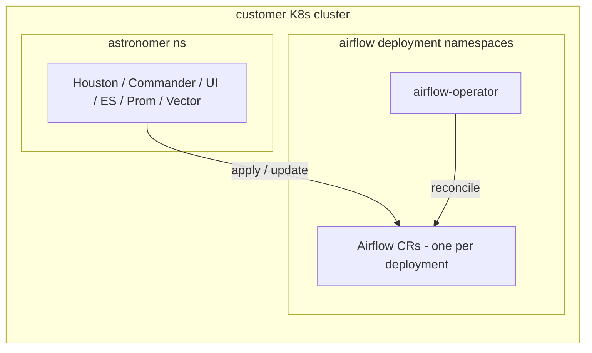
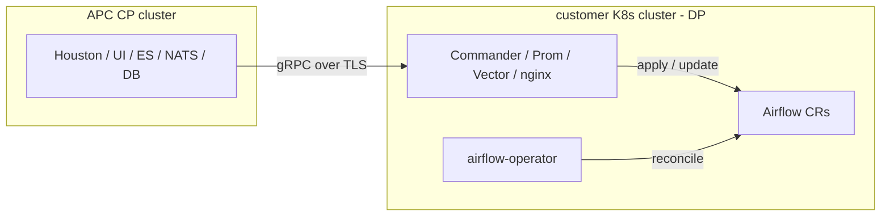

# M2 — [Stage 1 → 2] Astro Runtime operator to APC adoption

**Linear milestone:** [Stage 1 → 2] Astro Runtime operator to APC adoption
**Parent project:** [Operator Inheritance](https://linear.app/astronomer/project/operator-inheritance-6426e0c693ab)
**Status:** Planning — no Linear issues filed yet
**Owner:** _TBD_

> Parent index: [`00-overview.md`](00-overview.md)

---

## Starting state

The customer's Kubernetes cluster contains:

- The Astro Runtime Operator installed standalone (its own controller-manager pod, CRDs, webhooks, cert-manager).
- One or more `Airflow` custom resources under `airflow.apache.org/v1beta1`, each spawning a full Airflow deployment (scheduler, workers, webserver/apiServer, triggerer, redis, statsd, optional pgbouncer/postgres).
- A working DAG-execution path — i.e. customers can deploy DAGs and run them today, without APC.

The customer's K8s cluster does **not** contain:

- An APC control plane (Houston, registry, Astro UI, nginx, ES, NATS, etc.).
- An APC data plane (Commander, prometheus stack, vector/fluentd, kube-state-metrics, etc.).
- Any Houston DB record describing the deployments.

## End state for this milestone

After M2 completes:

1. The customer's cluster runs APC's data plane alongside the operator. The plane can be **unified** (CP and DP both here) or **split** (DP here, CP elsewhere).
2. Each pre-existing `Airflow` CR is reachable by Commander — Commander can read its spec, push updates, and ultimately delete it.
3. Each pre-existing `Airflow` CR has a corresponding `Deployment` row in Houston, attached to a workspace, with users mapped to APC roles.
4. The customer can log in to Astro UI / Houston API and see the deployments alongside any new ones they create.
5. DAGs continue scheduling and running with zero downtime during the transition.

## Tasks in this milestone

| # | Task | Doc |
|---|------|-----|
| 1 | Install the APC data plane onto the operator's cluster | [`m2-task-1-install-dp.md`](m2-task-1-install-dp.md) |
| 2 | Connect existing operator CRDs to Commander | [`m2-task-2-connect-operator-to-commander.md`](m2-task-2-connect-operator-to-commander.md) |
| 3 | Migrate Airflow deployments into the APC control plane | [`m2-task-3-migrate-deployments-to-cp.md`](m2-task-3-migrate-deployments-to-cp.md) |

These are sequential dependencies: a deployment can't be registered in Houston (Task 3) until Commander can manage it (Task 2), and Commander can't run until the DP is installed (Task 1).

## Topology decisions

There are two supported topologies for where the APC pieces land relative to the operator. Both must work; the customer chooses based on their deployment posture.

### Unified plane (CP + DP in the same cluster)

### Split CP / DP (CP elsewhere, DP in the operator's cluster)

The umbrella chart already supports both via `global.plane.mode` (`unified` | `control` | `data`) at [`astronomer/values.yaml:14-15`](../../../values.yaml#L14-L15) — Task 1 covers how we drive an existing operator cluster into the `data` (or `unified`) variant.

## Open questions for this milestone

- [ ] **Where does the operator's controller-manager live after adoption?** Stays in its current namespace, or gets migrated under the `astronomer` namespace's chart-managed subchart (`astronomer/charts/airflow-operator/`)?
- [ ] **Are operator deployments allowed across multiple namespaces, or one per namespace?** Affects how Commander tracks ownership.
- [ ] **What's the source-of-truth during the transition?** If a customer edits an `Airflow` CR directly with `kubectl` after adoption, do we reconcile, ignore, or refuse?
- [ ] **Do we require the customer to upgrade operator → v1.6.x as part of M2, or accept whatever they're on?** Couples to M3 / Task B.
- [ ] **Zero-downtime guarantee:** is it a contract, or best-effort? Pre-existing pods can't be touched, but Commander's secret-sync (registry creds, JWT) writes into the deployment namespace.

## Risks

| Risk | Severity | Notes |
|------|----------|-------|
| Commander's `ApplyCustomResource` is create-or-update and would overwrite the customer's existing `Airflow` CR | High | See [Task 2](m2-task-2-connect-operator-to-commander.md). Implementation: [`commander/kubernetes/custom_resource.go`](../../../../commander/kubernetes/custom_resource.go) — `Update()` replaces the whole spec. |
| Existing CRs may not carry fields Houston expects (e.g., labels, annotations, registry pull secrets) | High | See [Task 3](m2-task-3-migrate-deployments-to-cp.md). |
| Customer's existing observability stack collides with APC's (two prometheis, two log shippers) | Medium | See [Task 1](m2-task-1-install-dp.md) — DP install must allow opting components out. |
| Operator version mismatch between what APC chart pins (1.5.2) and what's installed | Medium | See [M3 Task B](m3-task-b-upgrade-operator-v16.md). |
| Customer's pre-existing RBAC (SAs, Roles, RoleBindings) collides with what APC creates | Medium | See [Task 3](m2-task-3-migrate-deployments-to-cp.md) and [`../03-gap-analysis.md`](../03-gap-analysis.md) Gap 6. |
